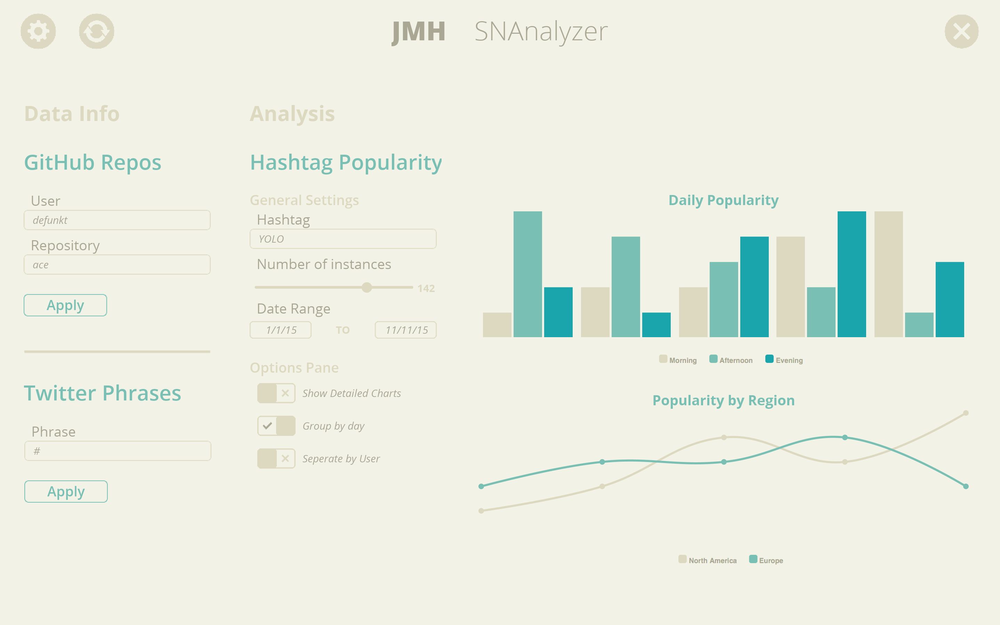
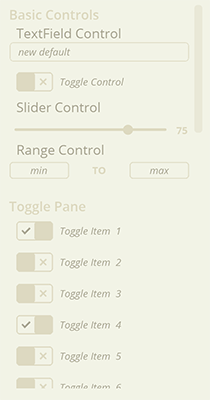
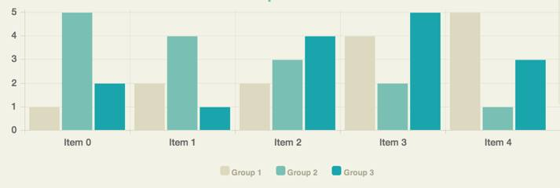
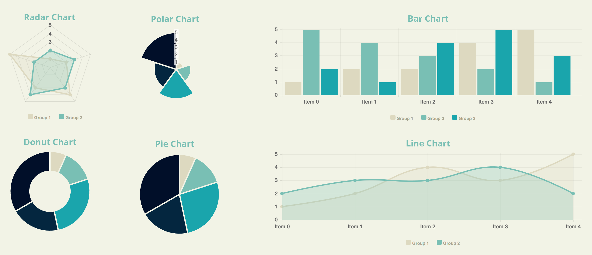

# JMH Social Network Analyzer


## Table of contents
[Posts] (#posts)

[Data] (#data)

[Data Plugins] (#data-plugins)

[Analysis Plugins] (#analysis-plugins)

[Web Library] (#web-library)

[Visualizer Library] (#visualizer-library)

## Posts
Posts are the core of social networks, and they are also the core of our Framework. We define posts to have the following fields:
* User (String)
* Time (Date)
* Location (String)
* Text (String)
* Source (String)
* Responses (int)
* Sentiment (SentimentEnum)


While plugin writers are responsible for determining the first six fields, the Framework takes responsibility for determining the Sentiment of the post.
### User
User is a String representing a way to identify a user of a social network. The plugin writers can determine whether they want to use the username or actual name (or something else) for this field.

### Time
We use the builtin Date class in Java to represent the time. It is up to the plugin writer to parse the time from their social networks.

### Location
We represent location as a String, which should be some concise way of identifying the location of a post (e.g. city or state).

### Source
By source, we mean the name of the social network you are pulling data from. For example, Facebook, Twitter, Tindr, etc.

### Responses
The plugin writers can define responses however they choose. One particular definition could be favorites + retweets on Twitter.

### Sentiment
We categorize sentiment as either positive, negative, or neutral, which is represented in the SentimentEnum as POSITIVE, NEGATIVE, and NEUTRAL respectively.

## Data
Data is the main object the [Analysis Plugins](analysis-plugins) will interact with from the Framework. This class provides flexible ways of allowing the plugins to access the posts they wanted. It provides methods to either get all the posts that passed each filter, or to get the posts that passed a specific filter. Note that if a Post passes any one filter it'll be in the Data object's set of posts. If the Analysis Plugins provide no filters, they'll still be able to access all the posts via the Data object using the getPosts() method.
## Data Plugins
Data plugins supply all of the Posts to the framework. The plugin writers will have a wealth of tools available to them in order to ease the process (See [Web Library] (#web-library)) of both fetching and parsing the data. All of the [Posts](#posts) that can be fetched are added into the pool of posts that the Framework keeps track of in order to pass them to the analysis plugins in the [Data](#data) object.
### Query Data
Our framework allows for data plugins to specify a mapping, from string to string,
of a key to a value that allows for runtime selected parameters to be involved with data retrieval.
Once created, our framework automatically creates fields for these parameters in the GUI. The user can then type in a value for the key, hit APPLY, and the dataplugin will receive the updated mapping allowing them to get data related to the parameter. For example, let's say we have a plugin that pulls tweets. If we want tweets from a specific person, we can create a "User": "Username" mapping for our query, return that, and the framework will automatically create a text field titled "Username". Once someone types into that text box and hits apply, (let's say they typed "Bob McGee"), the data plugin then gets the mapping back, but now it's "User": "Bob McGee", which can then be used to load data related to Bob McGee.
Side note: if "password" is the parameter key, the textfield will automatically be an encoded password field.

## Analysis Plugins
Analysis Plugins allow users to analyze data received from the Data Plugins. Our Framework has a concept of data sources for Analysis Plugins, which means that we have the users select the data plugins to analyze in the analysis plugins. Only posts that come from those Data Plugins will be passed to the Analysis Plugin. An Analysis Plugin can have multiple data sources. To set a data source for an analysis plugin, use framework.addDataSourceForAnalysisPlugin.

### Filters
Filters are our way of making the filtering of posts as extensible and reusable as possible for the plugin writers. A Filter has just one method, passesFilter, which takes in a post and should return true iff that post passes the filter. Since Filters will be their own classes, one filter can be used across multiple Analysis Plugins.

## Web Library
The goal of this library is to make is as easy as possible to parse one of the most common ways of encoding data, as well as to make it as easy as possible to send a variety of requests to different endpoints. We acheived this goal by doing error checking for you, which will help make writing code for the plugins look much cleaner and shorter.
### SimpleJson Parsing
These classes are wrappers around the [Json parsing library](http://www.json.org/java/). We call it 'Simple' because all the JSON parsing methods in the library throw an exception. The SimpleJson classes will automatically catch these errors for you and print a message to the console letting you know the error occured. 
#### SimpleJsonArray
The SimpleJsonArray makes parsing JSON arrays extremely easy. If you input a String into the constructor, it'll allow you to easily access the entries as SimpleJsonObjects. Simply use the getJsonObject(index) method to get a SimpleJsonObject. If an object is another array, you could use getJsonArray(index). The final feature this class provides is the asStringArray method, which will allow you to iterate over the items in the array as Strings.
#### SimpleJsonObject
This class makes parsing JSON objects trivial. Simply use the getString("field") method to get the field in the JsonObject as a string. This is probably the most common method you'll be using, but we have also provided ways to get ints, doubles, and even a SimpleJsonArray from a field. 
### HttpUtils
The HTTPUtils class provide easy interfaces to send GET and POST requests. The sendGetRequest method is very straightforward: provide a url, and it will provide a response. 

The sendPostRequest allows you to pass in a map from string to string, which will add those keys and values to the request data.

## Visualizer Library 
To see a demo use of this library, look at the included VisualizerDemo analysis plugin.

This custom library can be used to create stunning visuals with modular GUI controls to modify and manage the data, posts, charts, analysis or any other parameter of an analysis plugin, without having to do any GUI coding yourself. The library is very simple to use (only takes 1-4 lines of code for each component) and provides many options for controls, charts, and organization. The library uses [Chart.js](https://www.chartjs.org)

To use the visualizer library instead of creating your own GUI, simply create a new instance:
```java
Visualizer vis = new Visualizer();
```
Then add it to the provided JPanel:
```java
panel.add(vis);
```
Optionally, you can set the title or add any control panels and charts to the visualizer instance like this:
```java
vis.setTitle("My Analysis Plugin");
vis.addControlPanel(new ControlPanel());
vis.addChart(new RadarChart()); // visualizer can only display a maximum of 4 charts.
// you can specify the index to display the control panel or chart by calling
// vis.addControlPanel(index, ControlPanel) or
// vis.addChart(index, Chart)
// where index is an int and ControlPanel or Chart are control panel or chart instances.
```

If you are creating the library for the first time, you must call `vis.display()` AFTER adding all of the components (listed below) you want. If you need to update the GUI with changed/removed/added components (such as whenever `doAnalysis()` is called) you should use `vis.refresh()` to update the screen.

### Control Panels
You can add any number of control panels, which are groups of Controls, to the Visualizer, displayed in the order added unless an index is specified. 
An example control panel:
```java
// creates a control pane with 42 toggle controls
ControlPanel cp = new ControlPanel();
cp.setLabel("Toggle Settings");
for(int i=0; i<42; i++)
	cp.addControl(new ToggleControl());
// or cp.addControl(0, new ToggleControl()) to add to the first index
```
To add each Control Panel to the Visualizer, add by calling `vis.addControlPanel(cp)`.

##### Example of two control panels


### Controls
You can add any number of controls to any control panel, displayed in the order added unless an index is specified. Each control has very simple setter/getter methods to make implementing it in your plugin as easy as possible.
To create a control, simply initialize it `SliderControl control = new SliderControl()` and optionally add a label `control.setLabel("Number of Posts to Get")` or set a default value to display on startup `control.setDefaultValue(<Type> value)` where `<Type>` is the accepted value type (defined in list below). To get a value, call `control.getValue()`
You can store multiple controls using the Control interface. Here is an example method of storage below:
```java
// list to store controls in
private ArrayList<Control> controls = new ArrayList<Control>();
// add empty controls to list
for(int i=0; i<42; i++)
	controls.add(new RangeControl())
// print values from all controls
for(Control c : controls)
	System.out.println(c.getValue());
```
##### Control Types Available
To see an example of them, see the image in the Control Panel section
* TextFieldControl (String) <- can be set to a password field
* RangeControl (Range) <- Tuple with String min and String max
* SliderControl (int) <- constructor requires (min,max)
* ToggleControl (boolean)

### Charts
You can add up to 4 charts to the visualizer, displayed in the order added unless an index is specified. Each chart contains a list of data, and can be divided by datasets (groups of data) depending on if it is a multi-dataset chart or not. 
An example use of a single dataset chart is to display the most used words in a collection of posts.
An example use of a multi-dataset chart is to display the number of times a group of users posted per month for a year, with each user being a dataset containing it's own monthly values. Multi-dataset charts also have a detail level, which displays the labeling and grid lines if set to "true". You can set this by using `chart.setDetailed(true)` and by default, `chart.isDetailed()` is false.
Charts use DataPoints for their individual data values. This is the constructor:
```java
public DataPoint(String label, String group, double value);
// label : name of the section of the chart the data belongs to
// group : name of the dataset the point belongs to
// value : value of the point
// you can optionally use the setter/getter methods for each individual parameter
```


As an example, the figure above shows how the numbers on the side are the value, the descriptions along the bottom are the labels, and the colors are the groups.

You can add data to charts by calling `chart.addData(new DataPoint("item1",null,42)` and can also precede the datapoint with an index to add to a specific index.
To see a full list of available methods, take a look at the Chart interface (Chart.java).


##### Chart Types Available
* DonutChart (single dataset)
* PieChart (single dataset)
* PolarChart (single dataset)
* LineChart (multiple datasets)
* BarChart (multiple datasets)
* RadarChart (multiple datasets)
